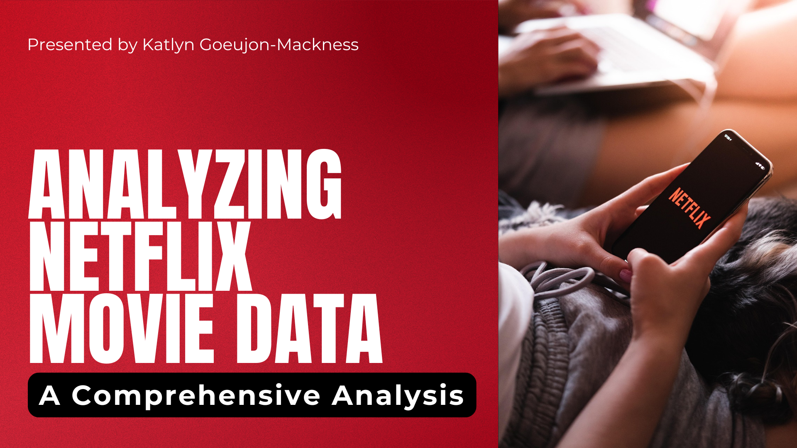

# Investigating Historical Movie Data

This project explores and analyzes Netflix’s extensive catalog of movies and series over the past 80 years to uncover valuable insights into the evolution of the entertainment industry.

---

## Table of Contents
- [Introduction](#introduction)  
- [Project Objectives](#project-objectives)  
- [Data Overview](#data-overview)  
- [Data Cleaning & Preparation](#data-cleaning--preparation)  
- [Exploratory Data Analysis](#exploratory-data-analysis)  
- [Conclusion](#conclusion)  
- [Future Work](#future-work)  
- [Getting Started](#getting-started)  
- [Repository Structure](#repository-structure)  
- [Contact](#contact)  

---

## Introduction

Over the past 80 years of cinema, the landscape has changed drastically around the world. Netflix, which began as a DVD rental service in 1997, has grown into one of the largest entertainment and media companies globally. With a vast array of content available on the platform, it presents a unique opportunity to delve into the entertainment industry and extract meaningful patterns and trends. In this analysis, we explore a dataset of Netflix movies and series to uncover strategic insights about genre popularity, geographic distribution, and audience preferences.

---

## Project Objectives

- Identify popular genres and trends over time  
- Understand the distribution of content across different countries  
- Gain insights into the types of shows and movies that resonate with audiences  
- Inform strategic decisions for content creation and acquisition  

This work is relevant for production companies, content creators, and marketers aiming to align their strategies with audience preferences and industry trends.

---

## Data Overview

The `netflix_data.csv` dataset contains the following columns:

| Column Name   | Description                                       |
|---------------|---------------------------------------------------|
| index         | A unique identifier for each row.                 |
| show_id       | A unique identifier for each title.               |
| type          | The type of the show (Movie / TV Show).           |
| title         | The title of the movie or series.                 |
| director      | The director of the title.                        |
| cast          | The main cast members.                            |
| country       | The country where the content was produced.       |
| date_added    | The date when the title was added to Netflix.     |
| release_year  | The year the title was released.                  |
| duration      | The duration in minutes (or number of seasons).   |
| description   | A brief synopsis of the title.                    |
| genre         | The primary genre of the title.                   |

---

## Data Cleaning & Preparation

- Handled missing values in `director`, `cast`, and `country` columns  
- Converted `date_added` to datetime objects  
- Filtered out titles with incomplete metadata for consistent analysis  

---

## Exploratory Data Analysis

- Content volume by decade and type  
- Genre distribution trends over time  
- Country-wise production volume  
- Runtime and season-length analysis by decade  

Visualizations include bar charts, line plots, and heatmaps to highlight key patterns and anomalies.

---

## Conclusion

Key findings:
- **Genre Shifts**: Certain genres (e.g., drama, documentary) have grown steadily, while others peaked in specific eras.  
- **Geographic Expansion**: Content production has diversified globally beyond a few dominant countries.  
- **Runtime Trends**: Average runtimes decreased over time, reflecting changes in audience consumption habits.

These insights can guide content acquisition strategies, genre investment decisions, and international market targeting.

---

## Future Work

- Deeper analysis of TV series trends (season counts, episode lengths)  
- Incorporate viewer ratings and sentiment data where available  
- Correlate release timing with external events (e.g., awards, platform expansions)  
- Compare with competitor platforms for cross-service insights  

---

## Getting Started

1. Clone the repository  
   ```bash
   git clone https://github.com/katiemackness/netflix-movie-data.git

2. Install dependencies  
   ```bash
   pip install -r requirements.txt

2. Run the analysis notebook 
 ```bash
  jupyter notebook Investigating_Historical_Movie_Data.ipynb
  ```
---

## Contact

**Katlyn Goeujon-Mackness**  
- **GitHub:** https://github.com/katiemackness
- **LinkedIn:** https://www.linkedin.com/in/katlyngm-datos/


